<h1 align="center">
  
</h1>

ME.dia is an app that generates cross platform media and entertainment recommendations. Just watched a good movie? But want something to read or watch on tv instead? We can do that! Tell us what you've watched or read and we'll give you more related media to enjoy. 

It's easy to go on Netflix and view your recommendations or view a currated playlist on Spotify, but with ME.dia you can get the both of best worlds. 

<h1 align="center">
  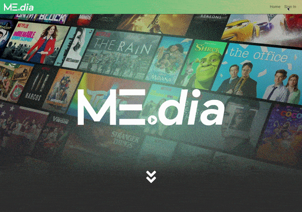
<h1>

<h5 align="center">Launch the application on (https://media-2018.herokuapp.com/)</h5>

## Built With :tv:
* HTML5 & CSS3
* [Bootstrap](https://getbootstrap.com/) - CSS framework
* [Javascript](https://www.javascript.com/) - programming language
* [Node.js](https://nodejs.org/en/) - javascript runtime
* [Express.js](https://expressjs.com/) - routing framework
* [Handlebars](http://handlebarsjs.com/) - semantic templating
* [Owl Carousel 2](https://owlcarousel2.github.io/OwlCarousel2/) - better carousel

### NPM Packages
* [bcrypt-nodejs](https://www.npmjs.com/package/bcrypt-nodejs) - Encrypt user password
* [body-parser](https://www.npmjs.com/package/body-parser) - Request parsing middleware
* [cookie-parser](https://www.npmjs.com/package/cookie-parser) - Middleware for cookies
* [dotenv](https://www.npmjs.com/package/dotenv) - Keep API keys hidden
* [Express](https://www.npmjs.com/package/express) - Server-side framework
* [Express-Handlebars](https://www.npmjs.com/package/express-handlebars) - Semantic templates for HTML generation
* [Express-session](https://www.npmjs.com/package/express-session) - Middleware for session data
* [mySQL2](https://www.npmjs.com/package/mysql2) - Make server-side SQL queries 
* [passport](http://www.passportjs.org/) - Authenticate requests 
* [passport-local](https://www.npmjs.com/package/passport-local) - Local login authentication
* [request](https://www.npmjs.com/package/request) - Make server-side API calls 
* [sequelize](http://docs.sequelizejs.com/) - ORM for SQL database

### APIs
* [The MovieDB](https://www.themoviedb.org/documentation/api) - Movie and TV Show recommendations

## Authors :key:
* **Sara Khosravinasr** - [saranasr83](https://github.com/saranasr83)
* **Robert Shaw** - [robertshaw87](https://github.com/robertshaw87)
* **Jimmy Tu** - [jimmytutron](https://github.com/jimmytutron)

## Routes :movie_camera:

<h1 align="center">
  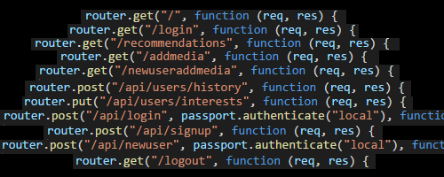
</h1>

Because this was a full stack app, we had to create our own routes for our client to interact with the server. We had to definte everything from the `get` methods that serve up html to the `post` and `put` methods to interact with our database. So many interconnected parts meant that the Front-end and the Back-end developers had to maintain good communication to produce a coherent product.

## Models :loudspeaker:

<h1 align="center">
  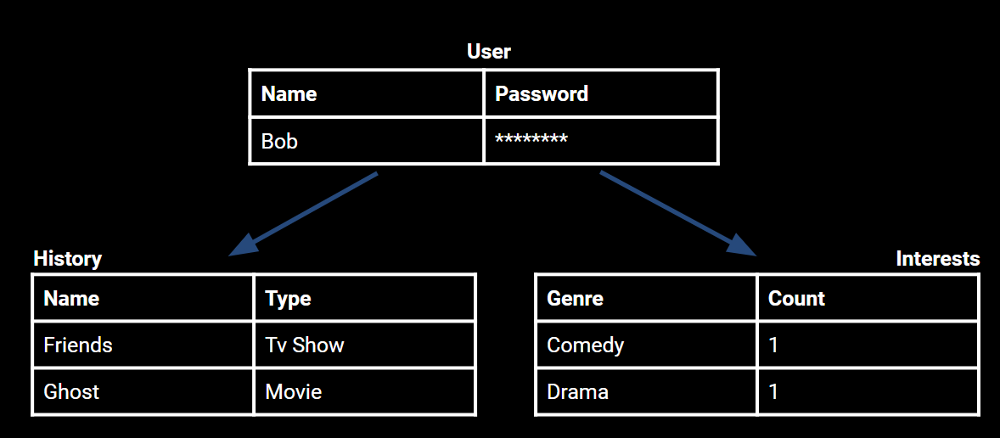
  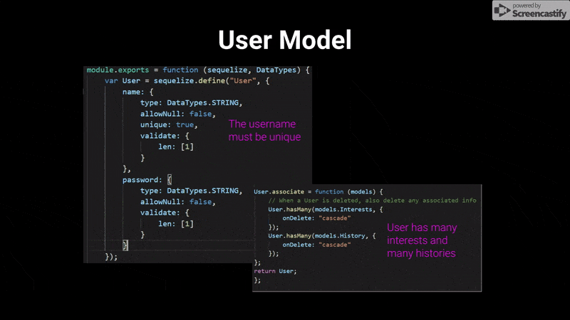
</h1>

We chose to keep the models for the app simple for now: each `user` has many `histories` and many `interests`. By splitting the view history and the user interests, we could more easily integrate addition types of media into our app by simply expanding the types available in the history table. In addition, we can still eventually choose to store more information about each movie/show/book/song that the user has seen without overcomplicating our interactions with the rest of the database.

## Database Interactions :computer:

<h1 align="center">
  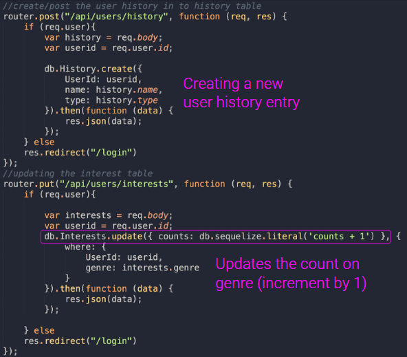
  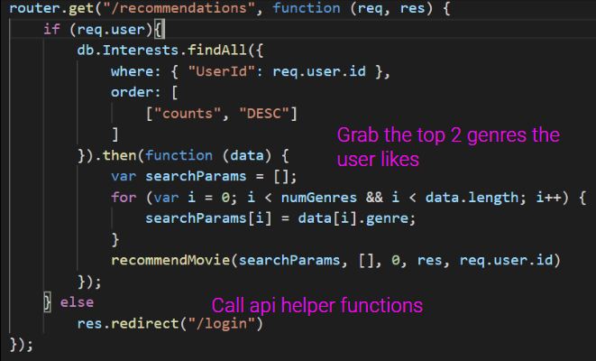
</h1>

With our models defined, we are able to interact with our database through the `sequelize` ORM. Creating a new view history item was relatively straightforward, but instead of having to read the database to get the current value before updating, we discovered a way to increment the interest count with the `sequelize.literal` method. Then for our recommendations, we are able to sort the data we were receiving from our query in order to easily grab the top two results. While we weren't able to find time to implement allowing the user to delete individual items from their view history, that is a planned feature for future iterations of this app.

## Login Authorization :lock:

<h1 align="center">
  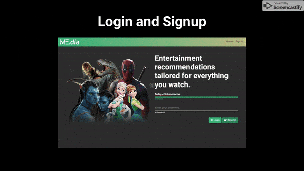
</h1>

Creating the login authorization logic was fairly challenging. It was a new technology that required a firm grasp on Front-end and Back-end interactions through middle-ware. When a new user signs up, the user model actually takes care of most of the authentication by making sure there isn’t already a user with the same name. It's when a user tries to login where the logic becomes more interesting. Our middleware tries to authenticate the login by checking to make sure that the user exists and then by comparing the encrypted passwords. 

We used the `bcrypt` node package in order to add a hook to the creation of a new `user` to encrypt the password before storing it. This way we don't have unencrypted passwords in our database at anytime. `bcrypt` also has the very helpful `compareSync` method that allows us to check whether the user provided password matches our records. Once the user logs in, their information becomes available in every request under the key of `user`.

## User Recommendations :mag:

<h1 align="center">
  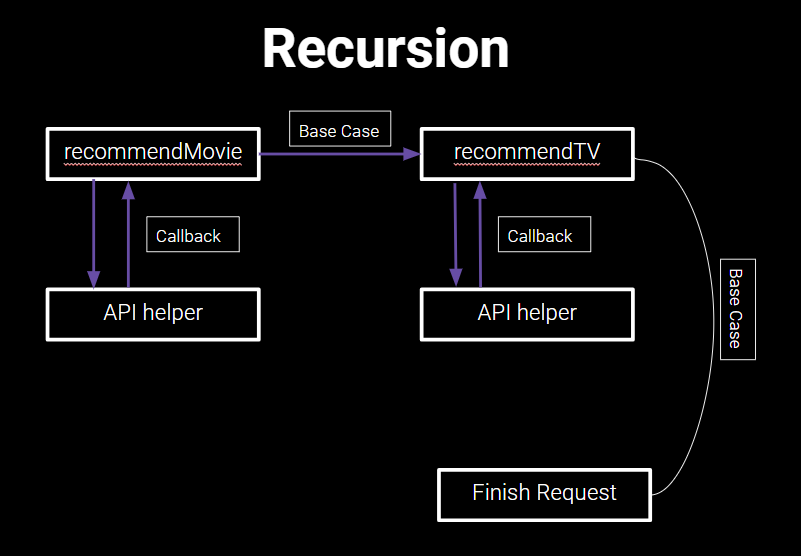
  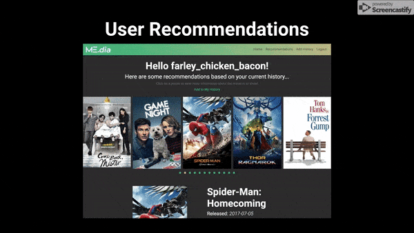
</h1>

Our algorithm for user recommendations is currently fairly simple: we recommend movies from their top two favorite genres. We have left this open to expansion in later iterations where we will hopefully have time to use more complicated logic. 

In order to make sequential API calls to grab those recommendations, we chose to write recursive helper functions. The helper function that makes the API call gets passed a callback function pointing to the `recommend` function that executes the helper function. This gives us a little more scaleability in the event that we wish to expand the number of APIs we're using.

Storing information we want to return to the user under a global variable would have created conflicts in the event of multiple simultaneous users, so we passed the variables we’re operating on into each function as arguments. It was challenging making sure that both the recursive logic was sound and that 

## Handlebars :man:

<h1 align="center">
  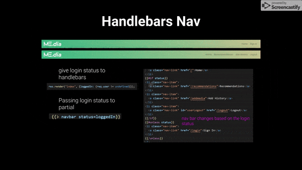
</h1>

We decided to use the `Handlebars` rendering engine so we can more easily provide data from the server to the html. `Handlebars` features power tools such as conditionals and array iteration within the html itself. We were able to decide which links the user saw on the navbar just by providing and handling a boolean indicating whether the user was signed in. `Handlebars` also allowed us to iterate through an array of media objects from the recommendations API call without resorting to multiple lines of javascript on the client side.

## Planned Features :bulb:

<h1 align="center">
  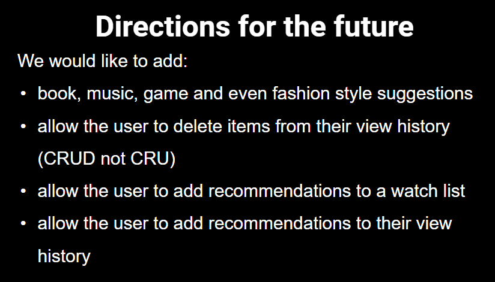
</h1>

Of course we haven't yet implemented all the ideas we envisioned. We hope to find the opportunity to work together in the future to expand the scope of this app.

## Acknowledgments :pray:
A huuuuge MEGA bigly thank you to our instructor, Jerome, and the TAs, Amber, Ricky, and Sasha!!  :grimacing:
